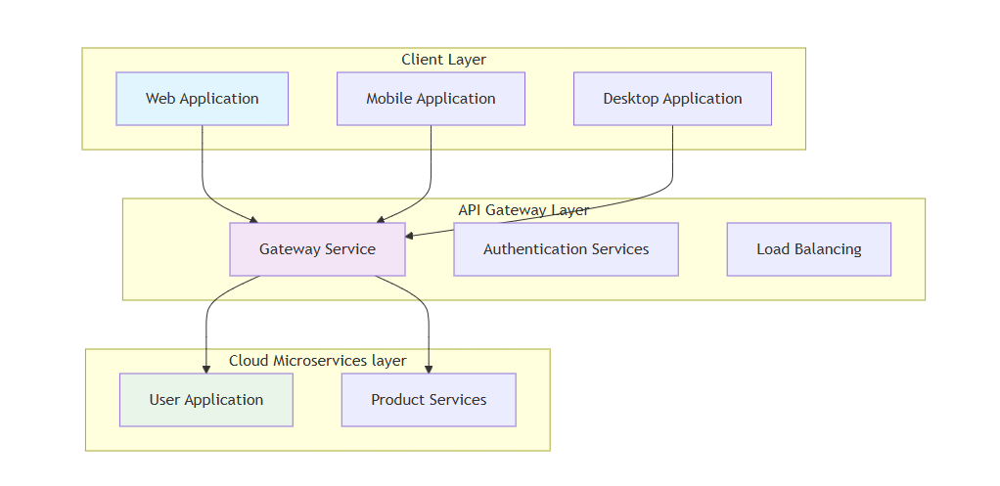

 [](https://products.aspose.cloud/cells/php/) [](https://docs.aspose.cloud/cells/) [](https://reference.aspose.cloud/cells/) [](https://github.com/aspose-cells-cloud/aspose-cells-cloud-php/tree/master/Examples) [](https://blog.aspose.cloud/categories/aspose.cells-cloud-product-family/) [](https://forum.aspose.cloud/c/cells/7)   [](https://github.com/aspose-cells-cloud/aspose-cells-cloud-go/blob/master/LICENSE?style=for-the-badge) [](https://packagist.org/packages/aspose/cells-sdk-php) 

<p align="center">
  <a href="#english">English</a> |
  <a href="#中文">中文</a> |
  <a href="#日本語">日本語</a> |
  <a href="#deutsch">Deutsch</a>
</p>

---

## English

[Aspose.Cells Cloud SDK for PHP](https://products.aspose.cloud/cells/php) is a cloud-native REST API that enables PHP developers to **create**, **read**, **edit**, **convert**, and **repair** spreadsheet files — including **Excel** (**XLS**, **XLSX**, **XLSB**, **XLSM**), **OpenDocument Spreadsheet** (**ODS**), **CSV**, **TSV**, **JSON**, **HTML**, **PDF**, and **more** — all **without requiring Microsoft Excel or Office to be installed**.

Built on the **Aspose.Cells Cloud Web API**, this MIT-licensed SDK supports advanced spreadsheet operations such as:

- Cell formatting, formulas, and data validation
- Pivot tables, charts, hyperlinks, and comments
- Conditional formatting and smart markers
- Worksheet merging, splitting, and protection
- Batch processing and background removal

It seamlessly integrates with **AWS**, **Microsoft Azure**, and **Google Cloud**, ensuring **high availability**, **scalability**, and **data integrity**. Ideal for serverless apps, microservices, and cloud automation workflows.

### Quick Start Guide

To begin with Aspose.Cells Cloud, here's what you need to do:

1. Sign up for an account at [Aspose for Cloud](https://dashboard.aspose.cloud/#/apps) to obtain your application details.
2. Install the Aspose.Cells Cloud PHP Package from [Packagist](https://packagist.org/packages/aspose/cells-sdk-php).

   **To install Aspose.Cells Cloud via Composer, follow these steps:**
   - Add Aspose.Cells Cloud as a dependency to your `composer.json` file:

   ```json
   {
     "require": {
       "aspose/cells-cloud": "^26.7.0"
     }
   }
   ```

   - Run Composer to install Aspose.Cells Cloud SDK:

   ```bash
   composer install
   ```

   - Include Composer's autoloader in your PHP code:

   ```php
   require 'vendor/autoload.php';
   ```

   - You're now ready to use Aspose.Cells Cloud in your PHP project.

3. Use the conversion code provided below as a reference to add or modify your application.

### Convert an Excel File Using PHP

```php
<?php
require_once('vendor/autoload.php');
use \Aspose\Cells\Cloud\Api\CellsApi;
use \Aspose\Cells\Cloud\Request\PutConvertWorkbookRequest;

#get CellsCloudClientId from https://dashboard.aspose.cloud/#/applications
#get CellsCloudClientSecret from https://dashboard.aspose.cloud/#/applications
$cellsApi = new CellsApi(getenv("CellsCloudClientId"),getenv("CellsCloudClientSecret"));
$response = $cellsApi->convertSpreadsheet(new \Aspose\Cells\Cloud\Request\ConvertSpreadsheetRequest( 'examples/EmployeeSalesSummary.xlsx', 'pdf'),"EmployeeSalesSummary.pdf");

```

### Supported File Formats

| **Format**                                                        | **Description**                                                                                                                                                                     | **Load** | **Save** |
| :---------------------------------------------------------------- | :---------------------------------------------------------------------------------------------------------------------------------------------------------------------------------- | :------- | :------- |
| [XLS](https://docs.fileformat.com/spreadsheet/xls/)               | Excel 95/5.0 - 2003 Workbook.                                                                                                                                                       | &radic;  | &radic;  |
| [XLSX](https://docs.fileformat.com/spreadsheet/xlsx/)             | Office Open XML SpreadsheetML Workbook or template file, with or without macros.                                                                                                    | &radic;  | &radic;  |
| [XLSB](https://docs.fileformat.com/spreadsheet/xlsb/)             | Excel Binary Workbook.                                                                                                                                                              | &radic;  | &radic;  |
| [XLSM](https://docs.fileformat.com/spreadsheet/xlsm/)             | Excel Macro-Enabled Workbook.                                                                                                                                                       | &radic;  | &radic;  |
| [XLT](https://docs.fileformat.com/spreadsheet/xlt/)               | Excel 97 - Excel 2003 Template.                                                                                                                                                     | &radic;  | &radic;  |
| [XLTX](https://docs.fileformat.com/spreadsheet/xltx/)             | Excel Template.                                                                                                                                                                     | &radic;  | &radic;  |
| [XLTM](https://docs.fileformat.com/spreadsheet/xltm/)             | Excel Macro-Enabled Template.                                                                                                                                                       | &radic;  | &radic;  |
| [XLAM](https://docs.fileformat.com/spreadsheet/xlam/)             | An Excel Macro-Enabled Add-In file that is used to add new functions to Excel.                                                                                                      |          | &radic;  |
| [CSV](https://docs.fileformat.com/spreadsheet/csv/)               | CSV (Comma Separated Value) file.                                                                                                                                                   | &radic;  | &radic;  |
| [TSV](https://docs.fileformat.com/spreadsheet/tsv/)               | TSV (Tab-separated values) file.                                                                                                                                                    | &radic;  | &radic;  |
| [TXT](https://docs.fileformat.com/word-processing/txt/)           | Delimited plain text file.                                                                                                                                                          | &radic;  | &radic;  |
| [HTML](https://docs.fileformat.com/web/html/)                     | HTML format.                                                                                                                                                                        | &radic;  | &radic;  |
| [MHTML](https://docs.fileformat.com/web/mhtml/)                   | MHTML file.                                                                                                                                                                         | &radic;  | &radic;  |
| [ODS](https://docs.fileformat.com/spreadsheet/ods/)               | ODS (OpenDocument Spreadsheet).                                                                                                                                                     | &radic;  | &radic;  |
| [Numbers](https://docs.fileformat.com/spreadsheet/numbers/)       | The document is created by Apple's "Numbers" application which forms part of Apple's iWork office suite, a set of applications which run on the Mac OS X and iOS operating systems. | &radic;  |          |
| [JSON](https://docs.fileformat.com/web/json/)                     | JavaScript Object Notation                                                                                                                                                          | &radic;  | &radic;  |
| [DIF](https://docs.fileformat.com/spreadsheet/dif/)               | Data Interchange Format.                                                                                                                                                            |          | &radic;  |
| [PDF](https://docs.fileformat.com/pdf/)                           | Adobe Portable Document Format.                                                                                                                                                     |          | &radic;  |
| [XPS](https://docs.fileformat.com/page-description-language/xps/) | XML Paper Specification Format.                                                                                                                                                     |          | &radic;  |
| [SVG](https://docs.fileformat.com/page-description-language/svg/) | Scalable Vector Graphics Format.                                                                                                                                                    |          | &radic;  |
| [TIFF](https://docs.fileformat.com/image/tiff/)                   | Tagged Image File Format                                                                                                                                                            |          | &radic;  |
| [PNG](https://docs.fileformat.com/image/png/)                     | Portable Network Graphics Format                                                                                                                                                    |          | &radic;  |
| [BMP](https://docs.fileformat.com/image/bmp/)                     | Bitmap Image Format                                                                                                                                                                 |          | &radic;  |
| [EMF](https://docs.fileformat.com/image/emf/)                     | Enhanced Metafile Format                                                                                                                                                            |          | &radic;  |
| [JPEG](https://docs.fileformat.com/image/jpeg/)                   | JPEG is a type of image format that is saved using the method of lossy compression.                                                                                                 |          | &radic;  |
| [GIF](https://docs.fileformat.com/image/gif/)                     | Graphical Interchange Format                                                                                                                                                        |          | &radic;  |
| [MARKDOWN](https://docs.fileformat.com/word-processing/md/)       | Represents a markdown document.                                                                                                                                                     |          | &radic;  |
| [SXC](https://docs.fileformat.com/spreadsheet/sxc/)               | An XML based format used by OpenOffice and StarOffice                                                                                                                               | &radic;  | &radic;  |
| [FODS](https://docs.fileformat.com/spreadsheet/fods/)             | This is an Open Document format stored as flat XML.                                                                                                                                 | &radic;  | &radic;  |
| [DOCX](https://docs.fileformat.com/word-processing/docx/)         | A well-known format for Microsoft Word documents that is a combination of XML and binary files.                                                                                     |          | &radic;  |
| [PPTX](https://docs.fileformat.com/presentation/pptx/)            | The PPTX format is based on the Microsoft PowerPoint open XML presentation file format.                                                                                             |          | &radic;  |
| [OTS](https://docs.fileformat.com/spreadsheet/ots/)               | OTS (OpenDocument Spreadsheet).                                                                                                                                                     | &radic;  | &radic;  |
| [XML](https://docs.fileformat.com/web/xml/)                       | XML file.                                                                                                                                                                           | &radic;  | &radic;  |
| [HTM](https://docs.fileformat.com/web/htm/)                       | HTM file.                                                                                                                                                                           | &radic;  | &radic;  |
| [TIF](https://docs.fileformat.com/image/tiff/)                    | Tagged Image File Format                                                                                                                                                            |          | &radic;  |
| [WMF](https://docs.fileformat.com/image/wmf/)                     | WMF Image Format                                                                                                                                                                    |          | &radic;  |
| [PCL](https://docs.fileformat.com/page-description-language/pcl/) | Printer Command Language Format                                                                                                                                                     |          | &radic;  |
| [AZW3](https://docs.fileformat.com/ebook/azw3/)                   | AZW3/KF8 File Format                                                                                                                                                                |          | &radic;  |
| [EPUB](https://docs.fileformat.com/ebook/epub/)                   | EPUB File Format                                                                                                                                                                    |          | &radic;  |
| [DBF](https://docs.fileformat.com/database/dbf/)                  | DBF File Format                                                                                                                                                                     |          | &radic;  |
| [XHTML](https://docs.fileformat.com/web/xhtml/)                   | XHTML File Format                                                                                                                                                                   |          | &radic;  |

### Architecture



### [Developer Reference](docs/DeveloperGuide.md#overview)

#### Manipulate Excel and Other Spreadsheet Files in the Cloud

- **File Manipulation** — Upload, download, delete, and manage Excel files stored in the cloud.
- **Formatting** — Supports formatting of cells, fonts, colors, and alignment modes in Excel files to cater to users' specific requirements.
- **Data Processing** — Powerful functions for data processing including reading, writing, modifying cell data, performing formula calculations, and formatting data.
- **Formula Calculation** — Built-in formula engine handles complex formula calculations in Excel and returns accurate results.
- **Chart Manipulation** — Create, edit, and delete charts from Excel files for data analysis and visualization needs.
- **Table Processing** — Robust processing capabilities for various form operations such as creation, editing, formatting, and conversion, meeting diverse form processing needs.
- **Data Verification** — Includes data verification function to set cell data type, range, uniqueness, ensuring data accuracy and integrity.
- **Batch Processing** — Supports batch processing of multiple Excel documents, such as batch format conversion, data extraction, and style application.
- **Import/Export** — Facilitates importing data from various sources into spreadsheets and exporting spreadsheet data to other formats.
- **Security Management** — Offers a range of security features like data encryption, access control, and permission management to safeguard the security and integrity of spreadsheet data.

### Features & Enhancements in Version v26.7

Full list of issues covering all changes in this release:

| **Summary**                                                                        | **Category** |
| :--------------------------------------------------------------------------------- | :----------- |
| Fix AutoFitsCanAutoFitsAttribute value data type.                                  | Bug          |
| Support for the calculation formula in Aspose.Cells Cloud 4.0 Web APIs.            | New Feature  |
| Support for the smart template in Aspose.Cells Cloud 4.0 Web APIs.                 | New Feature  |
| Fix calc error about MathCalculate Web API.                                        | Bug          |

### Available SDKs

The Aspose.Cells Cloud SDK is available in multiple popular programming languages, enabling developers to integrate spreadsheet processing capabilities across various development environments.

[](https://github.com/aspose-cells-cloud/aspose-cells-cloud-go) [](https://pkg.go.dev/github.com/aspose-cells-cloud/aspose-cells-cloud-go/v25)

[](https://github.com/aspose-cells-cloud/aspose-cells-cloud-java) [](https://github.com/aspose-cells-cloud/aspose-cells-cloud-java/blob/master/Aspose.Cells.Cloud.pom.xml)

[](https://github.com/aspose-cells-cloud/aspose-cells-cloud-dotnet) [](https://www.nuget.org/packages/Aspose.cells-Cloud/#readme-body-tab)

[](https://github.com/aspose-cells-cloud/aspose-cells-cloud-node) [](https://www.npmjs.com/package/asposecellscloud)

[](https://github.com/aspose-cells-cloud/aspose-cells-cloud-perl) [](https://metacpan.org/dist/AsposeCellsCloud-CellsApi)

[](https://github.com/aspose-cells-cloud/aspose-cells-cloud-php) [](https://packagist.org/packages/aspose/cells-sdk-php)

[](https://github.com/aspose-cells-cloud/aspose-cells-cloud-python) [](https://pypi.org/project/asposecellscloud/)

[](https://github.com/aspose-cells-cloud/aspose-cells-cloud-ruby) [](https://rubygems.org/gems/aspose_cells_cloud)

### [Release History](CHANGELOG.md)

---

## 中文

[Aspose.Cells Cloud SDK for PHP](https://products.aspose.cloud/cells/php) 是一个云原生 REST API，使 PHP 开发者能够**创建**、**读取**、**编辑**、**转换**和**修复**电子表格文件 — 包括 **Excel**（**XLS**、**XLSX**、**XLSB**、**XLSM**）、**OpenDocument 电子表格**（**ODS**）、**CSV**、**TSV**、**JSON**、**HTML**、**PDF** 等 — 且**无需安装 Microsoft Excel 或 Office**。

基于 **Aspose.Cells Cloud Web API** 构建，此 MIT 许可的 SDK 支持高级电子表格操作，例如：

- 单元格格式化、公式和数据验证
- 数据透视表、图表、超链接和批注
- 条件格式和智能标记
- 工作表合并、拆分和保护
- 批量处理和背景去除

它与 **AWS**、**Microsoft Azure** 和 **Google Cloud** 无缝集成，确保**高可用性**、**可扩展性**和**数据完整性**。非常适合无服务器应用、微服务和云自动化工作流。

### 快速入门指南

要开始使用 Aspose.Cells Cloud，您需要执行以下操作：

1. 在 [Aspose for Cloud](https://dashboard.aspose.cloud/#/apps) 注册账户以获取您的应用程序凭据。
2. 从 [Packagist](https://packagist.org/packages/aspose/cells-sdk-php) 安装 Aspose.Cells Cloud PHP 包。

   **要通过 Composer 安装 Aspose.Cells Cloud，请按照以下步骤操作：**
   - 将 Aspose.Cells Cloud 作为依赖项添加到您的 `composer.json` 文件中：

   ```json
   {
     "require": {
       "aspose/cells-cloud": "^26.7.0"
     }
   }
   ```

   - 运行 Composer 以安装 Aspose.Cells Cloud SDK：

   ```bash
   composer install
   ```

   - 在您的 PHP 代码中包含 Composer 的自动加载器：

   ```php
   require 'vendor/autoload.php';
   ```

   - 您现在可以在 PHP 项目中使用 Aspose.Cells Cloud 了。

3. 使用下面提供的转换代码作为参考来添加或修改您的应用程序。

### 使用 PHP 转换 Excel 文件

```php
<?php
require_once('vendor/autoload.php');
use \Aspose\Cells\Cloud\Api\CellsApi;
use \Aspose\Cells\Cloud\Request\PutConvertWorkbookRequest;

#从 https://dashboard.aspose.cloud/#/applications 获取 CellsCloudClientId
#从 https://dashboard.aspose.cloud/#/applications 获取 CellsCloudClientSecret
$cellsApi = new CellsApi(getenv("CellsCloudClientId"),getenv("CellsCloudClientSecret"));
$response = $cellsApi->convertSpreadsheet(new \Aspose\Cells\Cloud\Request\ConvertSpreadsheetRequest( 'examples/EmployeeSalesSummary.xlsx', 'pdf'),"EmployeeSalesSummary.pdf");

```

### 支持的文件格式

| **格式**                                                          | **描述**                                                                                       | **加载** | **保存** |
| :---------------------------------------------------------------- | :--------------------------------------------------------------------------------------------- | :------- | :------- |
| [XLS](https://docs.fileformat.com/spreadsheet/xls/)               | Excel 95/5.0 - 2003 工作簿。                                                                    | &radic;  | &radic;  |
| [XLSX](https://docs.fileformat.com/spreadsheet/xlsx/)             | Office Open XML SpreadsheetML 工作簿或模板文件（带或不带宏）。                                    | &radic;  | &radic;  |
| [XLSB](https://docs.fileformat.com/spreadsheet/xlsb/)             | Excel 二进制工作簿。                                                                             | &radic;  | &radic;  |
| [XLSM](https://docs.fileformat.com/spreadsheet/xlsm/)             | Excel 启用宏的工作簿。                                                                           | &radic;  | &radic;  |
| [XLT](https://docs.fileformat.com/spreadsheet/xlt/)               | Excel 97 - Excel 2003 模板。                                                                     | &radic;  | &radic;  |
| [XLTX](https://docs.fileformat.com/spreadsheet/xltx/)             | Excel 模板。                                                                                    | &radic;  | &radic;  |
| [XLTM](https://docs.fileformat.com/spreadsheet/xltm/)             | Excel 启用宏的模板。                                                                             | &radic;  | &radic;  |
| [XLAM](https://docs.fileformat.com/spreadsheet/xlam/)             | Excel 启用宏的加载项文件，用于向 Excel 添加新功能。                                                 |          | &radic;  |
| [CSV](https://docs.fileformat.com/spreadsheet/csv/)               | CSV（逗号分隔值）文件。                                                                           | &radic;  | &radic;  |
| [TSV](https://docs.fileformat.com/spreadsheet/tsv/)               | TSV（制表符分隔值）文件。                                                                         | &radic;  | &radic;  |
| [TXT](https://docs.fileformat.com/word-processing/txt/)           | 分隔的纯文本文件。                                                                                | &radic;  | &radic;  |
| [HTML](https://docs.fileformat.com/web/html/)                     | HTML 格式。                                                                                      | &radic;  | &radic;  |
| [MHTML](https://docs.fileformat.com/web/mhtml/)                   | MHTML 文件。                                                                                     | &radic;  | &radic;  |
| [ODS](https://docs.fileformat.com/spreadsheet/ods/)               | ODS（OpenDocument 电子表格）。                                                                     | &radic;  | &radic;  |
| [Numbers](https://docs.fileformat.com/spreadsheet/numbers/)       | 由 Apple "Numbers" 应用程序创建的文档，该应用程序是 Apple iWork 办公套件的一部分。                    | &radic;  |          |
| [JSON](https://docs.fileformat.com/web/json/)                     | JavaScript 对象表示法                                                                            | &radic;  | &radic;  |
| [DIF](https://docs.fileformat.com/spreadsheet/dif/)               | 数据交换格式。                                                                                   |          | &radic;  |
| [PDF](https://docs.fileformat.com/pdf/)                           | Adobe 便携式文档格式。                                                                            |          | &radic;  |
| [XPS](https://docs.fileformat.com/page-description-language/xps/) | XML 纸张规范格式。                                                                                |          | &radic;  |
| [SVG](https://docs.fileformat.com/page-description-language/svg/) | 可缩放矢量图形格式。                                                                              |          | &radic;  |
| [TIFF](https://docs.fileformat.com/image/tiff/)                   | 标记图像文件格式                                                                                  |          | &radic;  |
| [PNG](https://docs.fileformat.com/image/png/)                     | 便携式网络图形格式                                                                                |          | &radic;  |
| [BMP](https://docs.fileformat.com/image/bmp/)                     | 位图图像格式                                                                                     |          | &radic;  |
| [EMF](https://docs.fileformat.com/image/emf/)                     | 增强型图元文件格式                                                                                |          | &radic;  |
| [JPEG](https://docs.fileformat.com/image/jpeg/)                   | JPEG 是一种使用有损压缩方法保存的图像格式。                                                        |          | &radic;  |
| [GIF](https://docs.fileformat.com/image/gif/)                     | 图形交换格式                                                                                     |          | &radic;  |
| [MARKDOWN](https://docs.fileformat.com/word-processing/md/)       | 表示 Markdown 文档。                                                                              |          | &radic;  |
| [SXC](https://docs.fileformat.com/spreadsheet/sxc/)               | OpenOffice 和 StarOffice 使用的基于 XML 的格式                                                     | &radic;  | &radic;  |
| [FODS](https://docs.fileformat.com/spreadsheet/fods/)             | 以平面 XML 存储的 Open Document 格式。                                                             | &radic;  | &radic;  |
| [DOCX](https://docs.fileformat.com/word-processing/docx/)         | Microsoft Word 文档的常用格式，结合了 XML 和二进制文件。                                             |          | &radic;  |
| [PPTX](https://docs.fileformat.com/presentation/pptx/)            | 基于 Microsoft PowerPoint 开放 XML 演示文稿文件格式。                                               |          | &radic;  |
| [OTS](https://docs.fileformat.com/spreadsheet/ots/)               | OTS（OpenDocument 电子表格模板）。                                                                  | &radic;  | &radic;  |
| [XML](https://docs.fileformat.com/web/xml/)                       | XML 文件。                                                                                        | &radic;  | &radic;  |
| [HTM](https://docs.fileformat.com/web/htm/)                       | HTM 文件。                                                                                        | &radic;  | &radic;  |
| [TIF](https://docs.fileformat.com/image/tiff/)                    | 标记图像文件格式                                                                                  |          | &radic;  |
| [WMF](https://docs.fileformat.com/image/wmf/)                     | WMF 图像格式                                                                                      |          | &radic;  |
| [PCL](https://docs.fileformat.com/page-description-language/pcl/) | 打印机命令语言格式                                                                                |          | &radic;  |
| [AZW3](https://docs.fileformat.com/ebook/azw3/)                   | AZW3/KF8 文件格式                                                                                 |          | &radic;  |
| [EPUB](https://docs.fileformat.com/ebook/epub/)                   | EPUB 文件格式                                                                                     |          | &radic;  |
| [DBF](https://docs.fileformat.com/database/dbf/)                  | DBF 文件格式                                                                                      |          | &radic;  |
| [XHTML](https://docs.fileformat.com/web/xhtml/)                   | XHTML 文件格式                                                                                    |          | &radic;  |

### 架构


### 版本 v26.7 中的功能与增强

此版本中所有变更的完整列表：

| **摘要**                                                                           | **类别**   |
| :--------------------------------------------------------------------------------- | :--------- |
| 修复 AutoFitsCanAutoFitsAttribute 值数据类型。                                       | Bug        |
| 支持 Aspose.Cells Cloud 4.0 Web API 中的计算公式。                                    | 新功能      |
| 支持 Aspose.Cells Cloud 4.0 Web API 中的智能模板。                                    | 新功能      |
| 修复 MathCalculate Web API 的计算错误。                                               | Bug        |

---

## 日本語

[Aspose.Cells Cloud SDK for PHP](https://products.aspose.cloud/cells/php) は、PHP 開発者が **Excel**（**XLS**、**XLSX**、**XLSB**、**XLSM**）、**OpenDocument スプレッドシート**（**ODS**）、**CSV**、**TSV**、**JSON**、**HTML**、**PDF** などのスプレッドシートファイルを**作成**、**読み取り**、**編集**、**変換**、**修復**できるクラウドネイティブ REST API です。**Microsoft Excel や Office のインストールは不要です**。

**Aspose.Cells Cloud Web API** 上に構築されたこの MIT ライセンスの SDK は、次のような高度なスプレッドシート操作をサポートしています：

- セルの書式設定、数式、データ検証
- ピボットテーブル、グラフ、ハイパーリンク、コメント
- 条件付き書式とスマートマーカー
- ワークシートの結合、分割、保護
- バッチ処理と背景除去

**AWS**、**Microsoft Azure**、**Google Cloud** とシームレスに統合され、**高可用性**、**スケーラビリティ**、**データ整合性**を確保します。サーバーレスアプリ、マイクロサービス、クラウド自動化ワークフローに最適です。

### クイックスタートガイド

Aspose.Cells Cloud を始めるには、以下の手順に従ってください：

1. [Aspose for Cloud](https://dashboard.aspose.cloud/#/apps) でアカウントを作成し、アプリケーションの認証情報を取得します。
2. [Packagist](https://packagist.org/packages/aspose/cells-sdk-php) から Aspose.Cells Cloud PHP パッケージをインストールします。

   **Composer を使用して Aspose.Cells Cloud をインストールするには、次の手順に従ってください：**
   - `composer.json` ファイルに Aspose.Cells Cloud を依存関係として追加します：

   ```json
   {
     "require": {
       "aspose/cells-cloud": "^26.7.0"
     }
   }
   ```

   - Composer を実行して Aspose.Cells Cloud SDK をインストールします：

   ```bash
   composer install
   ```

   - PHP コードに Composer のオートローダーを含めます：

   ```php
   require 'vendor/autoload.php';
   ```

   - これで PHP プロジェクトで Aspose.Cells Cloud を使用する準備が整いました。

3. 以下の変換コードを参考に、アプリケーションを追加または変更してください。

### PHP を使用して Excel ファイルを変換する

```php
<?php
require_once('vendor/autoload.php');
use \Aspose\Cells\Cloud\Api\CellsApi;
use \Aspose\Cells\Cloud\Request\PutConvertWorkbookRequest;

#https://dashboard.aspose.cloud/#/applications から CellsCloudClientId を取得
#https://dashboard.aspose.cloud/#/applications から CellsCloudClientSecret を取得
$cellsApi = new CellsApi(getenv("CellsCloudClientId"),getenv("CellsCloudClientSecret"));
$response = $cellsApi->convertSpreadsheet(new \Aspose\Cells\Cloud\Request\ConvertSpreadsheetRequest( 'examples/EmployeeSalesSummary.xlsx', 'pdf'),"EmployeeSalesSummary.pdf");

```

### サポートされているファイル形式

| **形式**                                                          | **説明**                                                                                       | **読み込み** | **保存** |
| :---------------------------------------------------------------- | :--------------------------------------------------------------------------------------------- | :----------- | :------- |
| [XLS](https://docs.fileformat.com/spreadsheet/xls/)               | Excel 95/5.0 - 2003 ワークブック。                                                               | &radic;      | &radic;  |
| [XLSX](https://docs.fileformat.com/spreadsheet/xlsx/)             | Office Open XML SpreadsheetML ワークブックまたはテンプレートファイル（マクロあり/なし）。             | &radic;      | &radic;  |
| [XLSB](https://docs.fileformat.com/spreadsheet/xlsb/)             | Excel バイナリワークブック。                                                                      | &radic;      | &radic;  |
| [XLSM](https://docs.fileformat.com/spreadsheet/xlsm/)             | Excel マクロ有効ワークブック。                                                                    | &radic;      | &radic;  |
| [XLT](https://docs.fileformat.com/spreadsheet/xlt/)               | Excel 97 - Excel 2003 テンプレート。                                                              | &radic;      | &radic;  |
| [XLTX](https://docs.fileformat.com/spreadsheet/xltx/)             | Excel テンプレート。                                                                             | &radic;      | &radic;  |
| [XLTM](https://docs.fileformat.com/spreadsheet/xltm/)             | Excel マクロ有効テンプレート。                                                                    | &radic;      | &radic;  |
| [XLAM](https://docs.fileformat.com/spreadsheet/xlam/)             | Excel に新しい関数を追加するためのマクロ有効アドインファイル。                                      |              | &radic;  |
| [CSV](https://docs.fileformat.com/spreadsheet/csv/)               | CSV（カンマ区切り値）ファイル。                                                                   | &radic;      | &radic;  |
| [TSV](https://docs.fileformat.com/spreadsheet/tsv/)               | TSV（タブ区切り値）ファイル。                                                                     | &radic;      | &radic;  |
| [TXT](https://docs.fileformat.com/word-processing/txt/)           | 区切り形式のプレーンテキストファイル。                                                             | &radic;      | &radic;  |
| [HTML](https://docs.fileformat.com/web/html/)                     | HTML 形式。                                                                                      | &radic;      | &radic;  |
| [MHTML](https://docs.fileformat.com/web/mhtml/)                   | MHTML ファイル。                                                                                 | &radic;      | &radic;  |
| [ODS](https://docs.fileformat.com/spreadsheet/ods/)               | ODS（OpenDocument スプレッドシート）。                                                             | &radic;      | &radic;  |
| [Numbers](https://docs.fileformat.com/spreadsheet/numbers/)       | Apple iWork オフィススイートの一部である Apple "Numbers" アプリケーションで作成されたドキュメント。  | &radic;      |          |
| [JSON](https://docs.fileformat.com/web/json/)                     | JavaScript Object Notation                                                                      | &radic;      | &radic;  |
| [DIF](https://docs.fileformat.com/spreadsheet/dif/)               | Data Interchange Format。                                                                        |              | &radic;  |
| [PDF](https://docs.fileformat.com/pdf/)                           | Adobe Portable Document Format。                                                                 |              | &radic;  |
| [XPS](https://docs.fileformat.com/page-description-language/xps/) | XML Paper Specification Format。                                                                 |              | &radic;  |
| [SVG](https://docs.fileformat.com/page-description-language/svg/) | Scalable Vector Graphics Format。                                                                |              | &radic;  |
| [TIFF](https://docs.fileformat.com/image/tiff/)                   | Tagged Image File Format                                                                        |              | &radic;  |
| [PNG](https://docs.fileformat.com/image/png/)                     | Portable Network Graphics Format                                                                |              | &radic;  |
| [BMP](https://docs.fileformat.com/image/bmp/)                     | Bitmap Image Format                                                                             |              | &radic;  |
| [EMF](https://docs.fileformat.com/image/emf/)                     | Enhanced Metafile Format                                                                        |              | &radic;  |
| [JPEG](https://docs.fileformat.com/image/jpeg/)                   | JPEG は非可逆圧縮方式で保存される画像形式です。                                                    |              | &radic;  |
| [GIF](https://docs.fileformat.com/image/gif/)                     | Graphical Interchange Format                                                                    |              | &radic;  |
| [MARKDOWN](https://docs.fileformat.com/word-processing/md/)       | Markdown ドキュメントを表します。                                                                 |              | &radic;  |
| [SXC](https://docs.fileformat.com/spreadsheet/sxc/)               | OpenOffice および StarOffice で使用される XML ベースの形式                                         | &radic;      | &radic;  |
| [FODS](https://docs.fileformat.com/spreadsheet/fods/)             | フラット XML として保存された Open Document 形式。                                                 | &radic;      | &radic;  |
| [DOCX](https://docs.fileformat.com/word-processing/docx/)         | XML とバイナリファイルの組み合わせである Microsoft Word ドキュメントのよく知られた形式。              |              | &radic;  |
| [PPTX](https://docs.fileformat.com/presentation/pptx/)            | Microsoft PowerPoint オープン XML プレゼンテーションファイル形式に基づいています。                   |              | &radic;  |
| [OTS](https://docs.fileformat.com/spreadsheet/ots/)               | OTS（OpenDocument スプレッドシートテンプレート）。                                                  | &radic;      | &radic;  |
| [XML](https://docs.fileformat.com/web/xml/)                       | XML ファイル。                                                                                   | &radic;      | &radic;  |
| [HTM](https://docs.fileformat.com/web/htm/)                       | HTM ファイル。                                                                                   | &radic;      | &radic;  |
| [TIF](https://docs.fileformat.com/image/tiff/)                    | Tagged Image File Format                                                                        |              | &radic;  |
| [WMF](https://docs.fileformat.com/image/wmf/)                     | WMF Image Format                                                                                |              | &radic;  |
| [PCL](https://docs.fileformat.com/page-description-language/pcl/) | Printer Command Language Format                                                                 |              | &radic;  |
| [AZW3](https://docs.fileformat.com/ebook/azw3/)                   | AZW3/KF8 File Format                                                                            |              | &radic;  |
| [EPUB](https://docs.fileformat.com/ebook/epub/)                   | EPUB File Format                                                                                |              | &radic;  |
| [DBF](https://docs.fileformat.com/database/dbf/)                  | DBF File Format                                                                                 |              | &radic;  |
| [XHTML](https://docs.fileformat.com/web/xhtml/)                   | XHTML File Format                                                                               |              | &radic;  |

### アーキテクチャ


### バージョン v26.7 の機能と改善点

このリリースのすべての変更を含む問題の完全なリスト：

| **概要**                                                                           | **カテゴリ** |
| :--------------------------------------------------------------------------------- | :----------- |
| AutoFitsCanAutoFitsAttribute 値のデータ型を修正。                                     | Bug          |
| Aspose.Cells Cloud 4.0 Web API での計算式をサポート。                                  | New Feature  |
| Aspose.Cells Cloud 4.0 Web API でのスマートテンプレートをサポート。                     | New Feature  |
| MathCalculate Web API の計算エラーを修正。                                             | Bug          |

---

## Deutsch

[Aspose.Cells Cloud SDK for PHP](https://products.aspose.cloud/cells/php) ist eine cloud-native REST-API, die PHP-Entwicklern ermöglicht, Tabellenkalkulationsdateien zu **erstellen**, **lesen**, **bearbeiten**, **konvertieren** und **reparieren** — einschließlich **Excel** (**XLS**, **XLSX**, **XLSB**, **XLSM**), **OpenDocument Spreadsheet** (**ODS**), **CSV**, **TSV**, **JSON**, **HTML**, **PDF** und **mehr** — und das alles **ohne dass Microsoft Excel oder Office installiert sein muss**.

Aufbauend auf der **Aspose.Cells Cloud Web API** unterstützt dieses MIT-lizenzierte SDK fortgeschrittene Tabellenkalkulationsoperationen wie:

- Zellformatierung, Formeln und Datenvalidierung
- Pivot-Tabellen, Diagramme, Hyperlinks und Kommentare
- Bedingte Formatierung und Smart Marker
- Arbeitsblattzusammenführung, -aufteilung und -schutz
- Stapelverarbeitung und Hintergrundentfernung

Es integriert sich nahtlos mit **AWS**, **Microsoft Azure** und **Google Cloud** und gewährleistet **hohe Verfügbarkeit**, **Skalierbarkeit** und **Datenintegrität**. Ideal für serverlose Anwendungen, Microservices und Cloud-Automatisierungsworkflows.

### Schnellstart-Anleitung

Um mit Aspose.Cells Cloud zu beginnen, gehen Sie wie folgt vor:

1. Registrieren Sie sich bei [Aspose for Cloud](https://dashboard.aspose.cloud/#/apps) für ein Konto, um Ihre Anwendungsdaten zu erhalten.
2. Installieren Sie das Aspose.Cells Cloud PHP-Paket von [Packagist](https://packagist.org/packages/aspose/cells-sdk-php).

   **So installieren Sie Aspose.Cells Cloud über Composer:**
   - Fügen Sie Aspose.Cells Cloud als Abhängigkeit zu Ihrer `composer.json`-Datei hinzu:

   ```json
   {
     "require": {
       "aspose/cells-cloud": "^26.7.0"
     }
   }
   ```

   - Führen Sie Composer aus, um das Aspose.Cells Cloud SDK zu installieren:

   ```bash
   composer install
   ```

   - Binden Sie den Composer-Autoloader in Ihren PHP-Code ein:

   ```php
   require 'vendor/autoload.php';
   ```

   - Sie können Aspose.Cells Cloud nun in Ihrem PHP-Projekt verwenden.

3. Verwenden Sie den unten bereitgestellten Konvertierungscode als Referenz, um Ihre Anwendung zu ergänzen oder zu ändern.

### Excel-Datei mit PHP konvertieren

```php
<?php
require_once('vendor/autoload.php');
use \Aspose\Cells\Cloud\Api\CellsApi;
use \Aspose\Cells\Cloud\Request\PutConvertWorkbookRequest;

#CellsCloudClientId von https://dashboard.aspose.cloud/#/applications abrufen
#CellsCloudClientSecret von https://dashboard.aspose.cloud/#/applications abrufen
$cellsApi = new CellsApi(getenv("CellsCloudClientId"),getenv("CellsCloudClientSecret"));
$response = $cellsApi->convertSpreadsheet(new \Aspose\Cells\Cloud\Request\ConvertSpreadsheetRequest( 'examples/EmployeeSalesSummary.xlsx', 'pdf'),"EmployeeSalesSummary.pdf");

```

### Unterstützte Dateiformate

| **Format**                                                        | **Beschreibung**                                                                                                                                                                     | **Laden** | **Speichern** |
| :---------------------------------------------------------------- | :------------------------------------------------------------------------------------------------------------------------------------------------------------------------------------ | :-------- | :------------ |
| [XLS](https://docs.fileformat.com/spreadsheet/xls/)               | Excel 95/5.0 - 2003 Arbeitsmappe.                                                                                                                                                     | &radic;   | &radic;       |
| [XLSX](https://docs.fileformat.com/spreadsheet/xlsx/)             | Office Open XML SpreadsheetML Arbeitsmappe oder Vorlage, mit oder ohne Makros.                                                                                                       | &radic;   | &radic;       |
| [XLSB](https://docs.fileformat.com/spreadsheet/xlsb/)             | Excel Binär-Arbeitsmappe.                                                                                                                                                             | &radic;   | &radic;       |
| [XLSM](https://docs.fileformat.com/spreadsheet/xlsm/)             | Excel Makro-aktivierte Arbeitsmappe.                                                                                                                                                  | &radic;   | &radic;       |
| [XLT](https://docs.fileformat.com/spreadsheet/xlt/)               | Excel 97 - Excel 2003 Vorlage.                                                                                                                                                        | &radic;   | &radic;       |
| [XLTX](https://docs.fileformat.com/spreadsheet/xltx/)             | Excel Vorlage.                                                                                                                                                                        | &radic;   | &radic;       |
| [XLTM](https://docs.fileformat.com/spreadsheet/xltm/)             | Excel Makro-aktivierte Vorlage.                                                                                                                                                       | &radic;   | &radic;       |
| [XLAM](https://docs.fileformat.com/spreadsheet/xlam/)             | Eine Excel-Makro-Add-In-Datei, die verwendet wird, um Excel neue Funktionen hinzuzufügen.                                                                                             |           | &radic;       |
| [CSV](https://docs.fileformat.com/spreadsheet/csv/)               | CSV (Comma Separated Value) Datei.                                                                                                                                                    | &radic;   | &radic;       |
| [TSV](https://docs.fileformat.com/spreadsheet/tsv/)               | TSV (Tab-getrennte Werte) Datei.                                                                                                                                                      | &radic;   | &radic;       |
| [TXT](https://docs.fileformat.com/word-processing/txt/)           | Getrennte reine Textdatei.                                                                                                                                                            | &radic;   | &radic;       |
| [HTML](https://docs.fileformat.com/web/html/)                     | HTML-Format.                                                                                                                                                                          | &radic;   | &radic;       |
| [MHTML](https://docs.fileformat.com/web/mhtml/)                   | MHTML-Datei.                                                                                                                                                                          | &radic;   | &radic;       |
| [ODS](https://docs.fileformat.com/spreadsheet/ods/)               | ODS (OpenDocument Spreadsheet).                                                                                                                                                       | &radic;   | &radic;       |
| [Numbers](https://docs.fileformat.com/spreadsheet/numbers/)       | Das Dokument wird von Apples "Numbers"-Anwendung erstellt, die Teil von Apples iWork-Office-Suite ist.                                                                                | &radic;   |               |
| [JSON](https://docs.fileformat.com/web/json/)                     | JavaScript Object Notation                                                                                                                                                            | &radic;   | &radic;       |
| [DIF](https://docs.fileformat.com/spreadsheet/dif/)               | Data Interchange Format.                                                                                                                                                              |           | &radic;       |
| [PDF](https://docs.fileformat.com/pdf/)                           | Adobe Portable Document Format.                                                                                                                                                       |           | &radic;       |
| [XPS](https://docs.fileformat.com/page-description-language/xps/) | XML Paper Specification Format.                                                                                                                                                       |           | &radic;       |
| [SVG](https://docs.fileformat.com/page-description-language/svg/) | Scalable Vector Graphics Format.                                                                                                                                                      |           | &radic;       |
| [TIFF](https://docs.fileformat.com/image/tiff/)                   | Tagged Image File Format                                                                                                                                                              |           | &radic;       |
| [PNG](https://docs.fileformat.com/image/png/)                     | Portable Network Graphics Format                                                                                                                                                      |           | &radic;       |
| [BMP](https://docs.fileformat.com/image/bmp/)                     | Bitmap Image Format                                                                                                                                                                   |           | &radic;       |
| [EMF](https://docs.fileformat.com/image/emf/)                     | Enhanced Metafile Format                                                                                                                                                              |           | &radic;       |
| [JPEG](https://docs.fileformat.com/image/jpeg/)                   | JPEG ist ein Bildformat, das mit verlustbehafteter Komprimierung gespeichert wird.                                                                                                    |           | &radic;       |
| [GIF](https://docs.fileformat.com/image/gif/)                     | Graphical Interchange Format                                                                                                                                                          |           | &radic;       |
| [MARKDOWN](https://docs.fileformat.com/word-processing/md/)       | Repräsentiert ein Markdown-Dokument.                                                                                                                                                  |           | &radic;       |
| [SXC](https://docs.fileformat.com/spreadsheet/sxc/)               | Ein XML-basiertes Format, das von OpenOffice und StarOffice verwendet wird                                                                                                            | &radic;   | &radic;       |
| [FODS](https://docs.fileformat.com/spreadsheet/fods/)             | Ein Open Document-Format, das als flaches XML gespeichert wird.                                                                                                                       | &radic;   | &radic;       |
| [DOCX](https://docs.fileformat.com/word-processing/docx/)         | Ein bekanntes Format für Microsoft Word-Dokumente, das eine Kombination aus XML- und Binärdateien ist.                                                                                |           | &radic;       |
| [PPTX](https://docs.fileformat.com/presentation/pptx/)            | Das PPTX-Format basiert auf dem offenen XML-Präsentationsdateiformat von Microsoft PowerPoint.                                                                                        |           | &radic;       |
| [OTS](https://docs.fileformat.com/spreadsheet/ots/)               | OTS (OpenDocument Spreadsheet-Vorlage).                                                                                                                                               | &radic;   | &radic;       |
| [XML](https://docs.fileformat.com/web/xml/)                       | XML-Datei.                                                                                                                                                                            | &radic;   | &radic;       |
| [HTM](https://docs.fileformat.com/web/htm/)                       | HTM-Datei.                                                                                                                                                                            | &radic;   | &radic;       |
| [TIF](https://docs.fileformat.com/image/tiff/)                    | Tagged Image File Format                                                                                                                                                              |           | &radic;       |
| [WMF](https://docs.fileformat.com/image/wmf/)                     | WMF Image Format                                                                                                                                                                      |           | &radic;       |
| [PCL](https://docs.fileformat.com/page-description-language/pcl/) | Printer Command Language Format                                                                                                                                                       |           | &radic;       |
| [AZW3](https://docs.fileformat.com/ebook/azw3/)                   | AZW3/KF8 File Format                                                                                                                                                                  |           | &radic;       |
| [EPUB](https://docs.fileformat.com/ebook/epub/)                   | EPUB File Format                                                                                                                                                                      |           | &radic;       |
| [DBF](https://docs.fileformat.com/database/dbf/)                  | DBF File Format                                                                                                                                                                       |           | &radic;       |
| [XHTML](https://docs.fileformat.com/web/xhtml/)                   | XHTML File Format                                                                                                                                                                     |           | &radic;       |

### Architektur


### Funktionen & Verbesserungen in Version v26.7

Vollständige Liste der Issues zu allen Änderungen in diesem Release:

| **Zusammenfassung**                                                                | **Kategorie** |
| :--------------------------------------------------------------------------------- | :------------ |
| Datentyp des AutoFitsCanAutoFitsAttribute-Werts behoben.                           | Bug           |
| Unterstützung für Berechnungsformeln in Aspose.Cells Cloud 4.0 Web APIs.           | New Feature   |
| Unterstützung für intelligente Vorlagen in Aspose.Cells Cloud 4.0 Web APIs.        | New Feature   |
| Berechnungsfehler bei der MathCalculate Web API behoben.                           | Bug           |

---

### Available SDKs

The Aspose.Cells Cloud SDK is available in multiple popular programming languages, enabling developers to integrate spreadsheet processing capabilities across various development environments.

[](https://github.com/aspose-cells-cloud/aspose-cells-cloud-go) [](https://pkg.go.dev/github.com/aspose-cells-cloud/aspose-cells-cloud-go/v25)

[](https://github.com/aspose-cells-cloud/aspose-cells-cloud-java) [](https://github.com/aspose-cells-cloud/aspose-cells-cloud-java/blob/master/Aspose.Cells.Cloud.pom.xml)

[](https://github.com/aspose-cells-cloud/aspose-cells-cloud-dotnet) [](https://www.nuget.org/packages/Aspose.cells-Cloud/#readme-body-tab)

[](https://github.com/aspose-cells-cloud/aspose-cells-cloud-node) [](https://www.npmjs.com/package/asposecellscloud)

[](https://github.com/aspose-cells-cloud/aspose-cells-cloud-perl) [](https://metacpan.org/dist/AsposeCellsCloud-CellsApi)

[](https://github.com/aspose-cells-cloud/aspose-cells-cloud-php) [](https://packagist.org/packages/aspose/cells-sdk-php)

[](https://github.com/aspose-cells-cloud/aspose-cells-cloud-python) [](https://pypi.org/project/asposecellscloud/)

[](https://github.com/aspose-cells-cloud/aspose-cells-cloud-ruby) [](https://rubygems.org/gems/aspose_cells_cloud)

### [Release History](CHANGELOG.md)
